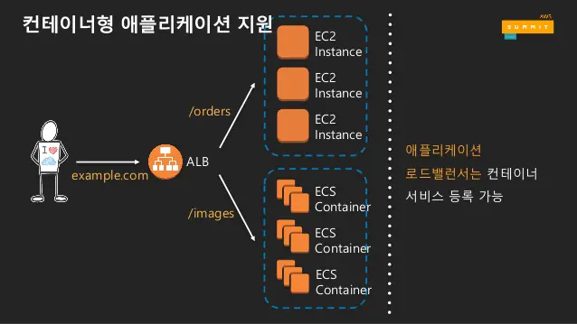
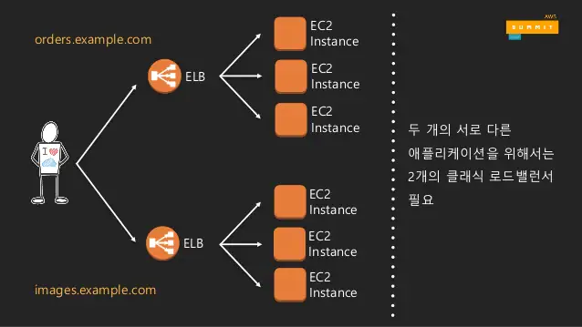
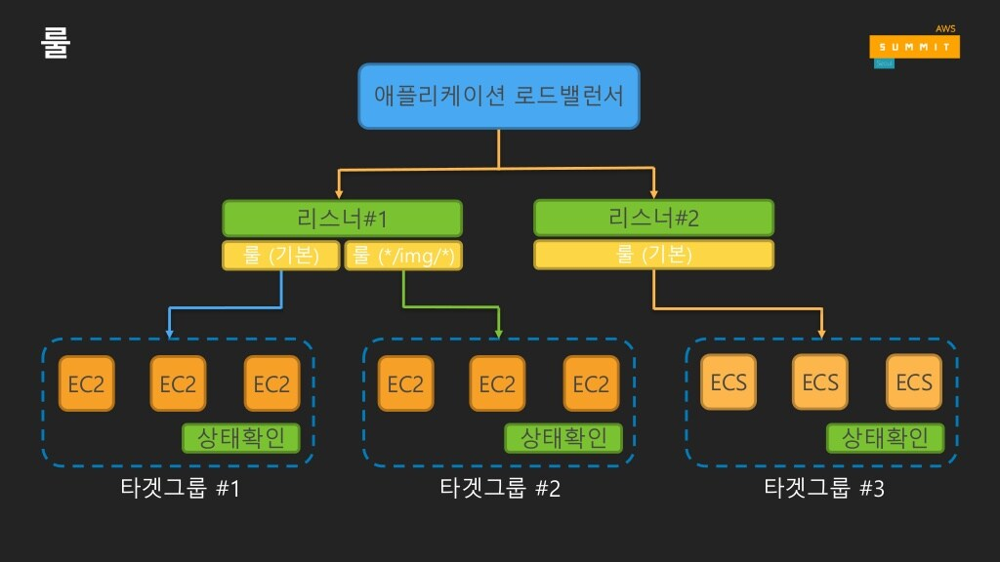

## 로드 밸런싱
- ALB
  
  - OSI 7계층
  - HTTP, HTTPS 지원
  - 연결은 로드 밸런서에서 종료, 로드 밸런서와 서버 별도 연결
  - 헤더 변경 가능
  - x-forward-for 헤더를 통해 클라이언트 ip 전달
  - 복수의 애플리케이션을 1개의 로드 밸런서로 처리  
- NLB
- CLB
  
  - OSI 4계층
  - 헤더 변경 미지원
  - 복수의 애플리케이션을 위해서는 복수의 클래식 로드 밸런서 필요 
  

